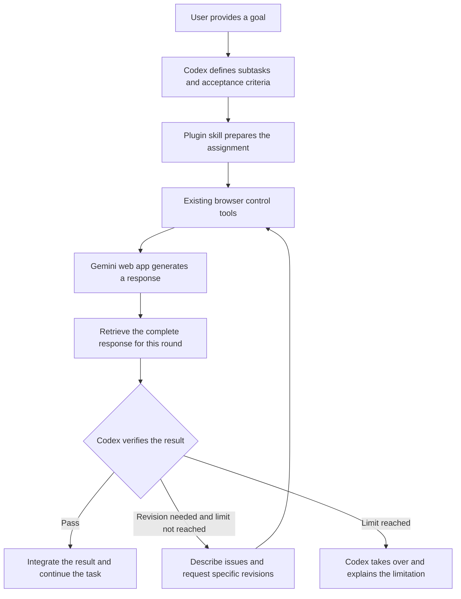

# Gemini Web Worker: Codex Coordinates Gemini on the Web

[English](README.md) | [繁體中文](README.zh-TW.md)

This prototype uses Codex to coordinate tasks and the Gemini web app to carry out assigned work. Codex breaks down the task, defines acceptance criteria, retrieves and verifies the response, and continues the user's original task. This division of work does not imply that either model is better at every task.

A real two-round exchange with the Gemini web app was completed on 2026-09-10. The function returned in the second round passed eight local test cases. See the [validation report](qa/REPORT.md).

## What is included

| Component | Purpose | Implementation |
| --- | --- | --- |
| Codex plugin | Package the entry point and operating instructions | `.codex-plugin/plugin.json` |
| Worker skill | Assign, retrieve, verify, and revise work | `skills/gemini-web-worker/SKILL.md` |
| Task protocol | Distinguish tasks, rounds, results, and completion state | UUIDs, round numbers, closing markers, and task records |
| Browser connection | Operate the normal Gemini web interface | Existing browser tools provided by Codex |

This is a plugin prototype executed by Codex after it reads the skill. It is not a standalone background process. The plugin does not include a browser engine, MCP server, Chrome extension, or scheduler; it requires a Codex environment with browser control. The skill instructs Codex to track state and respect retry limits, but a separate program does not enforce those rules.

OpenAI's documentation describes plugins that contain skills, and skills made up of instructions and optional scripts. See the [plugin overview](https://learn.chatgpt.com/docs/plugins) and [skill format](https://learn.chatgpt.com/docs/build-skills).

## Installation

Download this repository, point a Codex task with the plugin-creator skill and browser tools at the folder, and ask:

> Install this gemini-web-worker plugin into my personal Codex marketplace. Preserve the existing plugin settings, then verify that it is installed and enabled.

A personal installation places the plugin source in `~/plugins/gemini-web-worker` and registers it in `~/.agents/plugins/marketplace.json` using the official plugin-creator helper. After registration, run `codex plugin add gemini-web-worker@personal` using the actual marketplace name. If your marketplace is not named `personal`, substitute its real name. The default personal marketplace does not need a separate marketplace-add command.

Start a new Codex task after installation so it loads the new skill. Browser control must already be available separately; installing this skill does not grant additional browser permissions.

## Usage

In a new task, ask:

> Use the Gemini Web Worker skill to have the Gemini web app organize this public information. Define acceptance criteria first, verify the sources in its response, and finish the report for me. Request at most two revisions from Gemini.

For a coding task:

> Use the Gemini web app to write a pure function for the specified inputs. Review the code, run tests, and integrate it into the target project.

You can also ask Codex to read `skills/gemini-web-worker/SKILL.md` for a one-off operation without installing the plugin. This design does not require a new Gemini API key. Google's Gemini API is a separate integration that requires API authentication. See [Gemini API authentication](https://ai.google.dev/gemini-api/docs/api-key).

## Limitations

- Changes to the Gemini website, expired sign-ins, or usage limits can affect the workflow. Controls must be identified from the current page state.
- The prototype exchanges text and code. File uploads, images, video, Deep Research, and other long-running operations need additional retrieval and completion handling.
- Each task defaults to at most three rounds: the initial response and two revisions. Each generation round has a five-minute deadline. These limits can be adjusted for the task.
- Codex must still verify returned work. A model saying that tests passed is not evidence that the tests ran locally.
- The design can share generation work, but browser operation, assignments, response retrieval, and verification still consume Codex usage. Faster execution or lower cost is not guaranteed without measurement.
- The skill does not keep running after a Codex task ends. Long-term queues and automatic wake-ups require an additional scheduling design.

## Possible standalone implementation

A future version could add a local task queue and MCP tools for task creation, status checks, result retrieval, and cancellation, with explicitly authorized browser access through an extension or an existing control channel. This is an unimplemented future design. It would need completion detection, reconnection, duplicate-assignment handling, user takeover, access control, and version compatibility.

The first version tests the essential path: whether Codex can use existing browser tools to direct the Gemini web app, retrieve its answer, and continue the original task. Validation artifacts are in `qa/`.
