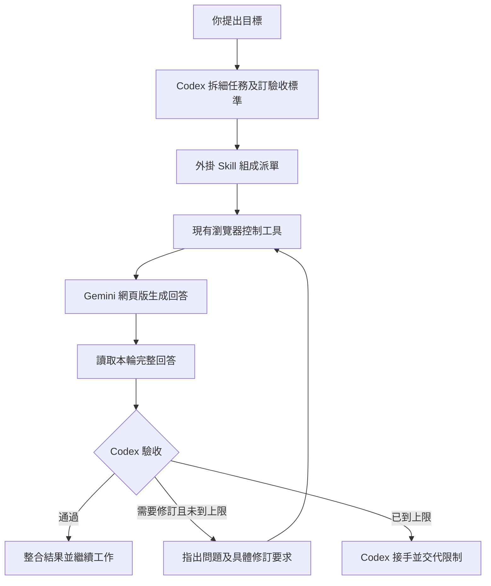

# Gemini Web Worker：Codex 指揮 Gemini 網頁版

[English](README.md) | [繁體中文](README.zh-TW.md)

呢個原型將 Codex 當成任務主管，Gemini 網頁版當成執行者。Codex 負責拆細工作、訂驗收標準、收回答覆、驗證，再繼續完成你原本嘅任務。分工唔代表任何一個模型喺所有任務上都比較強。

已於 2026-09-10 完成真實 Gemini 網頁兩輪來回，第二輪函數通過 8 個本機測試案例。詳見 [實測紀錄](qa/REPORT.md)。

## 呢一版有啲乜

| 部分 | 作用 | 實作方式 |
|---|---|---|
| Codex 外掛 | 封裝入口及操作規則 | `.codex-plugin/plugin.json` |
| Worker Skill | 派單、取回、驗收、修訂 | `skills/gemini-web-worker/SKILL.md` |
| 任務協議 | 分清任務、本輪結果及完成狀態 | UUID、輪次、結尾標記、任務紀錄 |
| 瀏覽器連線 | 操作 Gemini 正常網頁介面 | 沿用 Codex 已提供嘅瀏覽器工具 |

呢個係由 Codex 讀取 Skill 後執行嘅外掛原型，唔係獨立常駐程式。外掛本身唔包含瀏覽器引擎、MCP server、Chrome extension 或背景排程；需要喺有瀏覽器控制能力嘅 Codex 工作環境使用。狀態及重試上限由 Skill 指導 Codex 遵守，未有獨立程式強制執行。

OpenAI 官方文件確認，外掛可以包含 Skills，而 Skill 可以由指令及可選腳本組成。[外掛說明](https://learn.chatgpt.com/docs/plugins)、[Skill 格式](https://learn.chatgpt.com/docs/build-skills)。

## 安裝

下載呢個儲存庫後，喺有 plugin-creator 同瀏覽器控制工具嘅 Codex task 指定資料夾，再講：

> 將呢個 gemini-web-worker 外掛安裝到我嘅個人 Codex marketplace，保留現有外掛設定，再確認已安裝及啟用。

個人安裝將外掛來源放喺 `~/plugins/gemini-web-worker`，透過官方 plugin-creator helper 登記到 `~/.agents/plugins/marketplace.json`。登記完成後，用 marketplace 內實際名稱執行 `codex plugin add gemini-web-worker@personal`；如果你嘅 marketplace 名稱唔係 `personal`，就用實際名稱。預設個人 marketplace 唔需要另外執行 marketplace add。

安裝後開一個新 Codex task，令佢載入新增 Skill。瀏覽器控制工具需要另外已可用；安裝呢個 Skill 唔會自動新增瀏覽器權限。

## 點樣用

喺新 task 講：

> 用呢個 Gemini Web Worker Skill，將呢段公開資料交畀 Gemini 網頁版整理。你先定驗收標準，收返結果後核實來源，再幫我完成報告。最多要求 Gemini 修訂兩次。

程式例子：

> 用 Gemini 網頁版寫一個處理指定輸入嘅純函數。由你檢查程式、執行測試，再整合到指定專案。

未安裝時亦可以指定 Codex 讀取 `skills/gemini-web-worker/SKILL.md` 進行一次操作。設計唔依賴新增 Gemini API key；Google 官方 Gemini API 係另一條需要 API 認證嘅路徑。[Gemini API 認證](https://ai.google.dev/gemini-api/docs/api-key)。

## 實際限制

- Gemini 網頁改版、登入過期或額度限制會影響流程；需要以當時頁面狀態辨認控制項。
- 原型只處理文字及程式碼來回。檔案上傳、圖片、影片、Deep Research 等長工作需要另外加入對應收取及完成判斷。
- 預設每個任務最多三輪（首次加兩次修訂），每輪生成期限五分鐘；可以按任務調整。
- 收到回答後仍然要由 Codex 檢查。模型講「測試通過」唔等於本機實際測試過。
- 呢個設計可以分擔生成工作，但瀏覽器操作、派單、讀答案同驗收仍會用 Codex 額度；未量度前唔保證更快或更慳。
- Codex task 結束後，Skill 唔會自行繼續執行；要長期排隊及自動喚醒，需要額外嘅排程設計。

## 如要升級成獨立程式

下一版可以加入本機任務佇列及 MCP 工具，提供建立任務、查狀態、讀結果同取消嘅介面；瀏覽器端用有明確授權嘅擴充功能或既有控制通道。呢個係未實作嘅後續設計，需要實作完成判斷、斷線恢復、重複派送處理、使用者接管、存取控制及版本相容。

第一版先驗證最重要嘅路徑：Codex 能否透過現有瀏覽器工具，指揮 Gemini 網頁版並將答案收返繼續工作。實測資料放喺 `qa/`。

