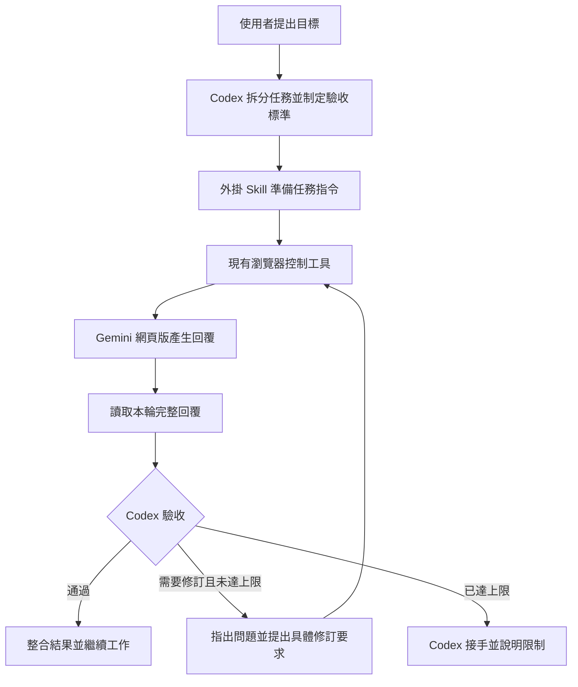

# Gemini Web Worker：Codex 指揮 Gemini 網頁版

[English](README.md) | [繁體中文](README.zh-TW.md)

此原型由 Codex 統籌任務，並由 Gemini 網頁版執行所分配的工作。Codex 負責拆分任務、制定驗收標準、取得並驗證回覆，再繼續完成使用者原本的任務。這種分工並不表示任何一個模型在所有任務上都較為優秀。

已於 2026-09-10 完成與 Gemini 網頁版的兩輪實際互動，第二輪回傳的函數通過 8 個本機測試案例。詳見[實測紀錄](qa/REPORT.md)。

## 專案內容

| 元件 | 用途 | 實作方式 |
| --- | --- | --- |
| Codex 外掛 | 封裝入口及操作規則 | `.codex-plugin/plugin.json` |
| Worker Skill | 分配任務、取得結果、驗收及修訂 | `skills/gemini-web-worker/SKILL.md` |
| 任務協議 | 區分任務、當輪結果及完成狀態 | UUID、輪次、結尾標記、任務紀錄 |
| 瀏覽器連線 | 操作 Gemini 的一般網頁介面 | 沿用 Codex 已提供的瀏覽器工具 |

此專案是由 Codex 讀取 Skill 後執行的外掛原型，並非獨立常駐程式。外掛本身不包含瀏覽器引擎、MCP 伺服器、Chrome 擴充功能或背景排程，必須在具備瀏覽器控制能力的 Codex 工作環境中使用。狀態追蹤及重試次數上限由 Skill 指導 Codex 遵守，目前沒有獨立程式強制執行這些規則。

OpenAI 官方文件說明，外掛可以包含 Skills，而 Skill 可以由指令及可選的腳本組成。詳見[外掛說明](https://learn.chatgpt.com/docs/plugins)及 [Skill 格式](https://learn.chatgpt.com/docs/build-skills)。

## 安裝

下載此儲存庫後，在具備 plugin-creator Skill 及瀏覽器控制工具的 Codex 任務中指定資料夾，並輸入：

> 請將此 gemini-web-worker 外掛安裝至我的個人 Codex 外掛市集，保留現有外掛設定，然後確認已安裝並啟用。

個人安裝會將外掛來源放在 `~/plugins/gemini-web-worker`，並透過官方 plugin-creator 輔助工具登記至 `~/.agents/plugins/marketplace.json`。登記完成後，使用市集的實際名稱執行 `codex plugin add gemini-web-worker@personal`；如果市集名稱不是 `personal`，請替換為實際名稱。預設的個人市集不需要另外執行 marketplace add。

安裝後請開啟新的 Codex 任務，以載入新增的 Skill。瀏覽器控制工具必須已另行提供；安裝此 Skill 不會自動增加瀏覽器權限。

## 使用方式

在新任務中輸入：

> 請使用 Gemini Web Worker Skill，將這段公開資料交由 Gemini 網頁版整理。先制定驗收標準，取得結果後核實來源，再完成報告。最多要求 Gemini 修訂兩次。

程式開發範例：

> 請使用 Gemini 網頁版撰寫處理指定輸入的純函數。由 Codex 檢查程式碼、執行測試，再整合至指定專案。

即使未安裝外掛，也可以請 Codex 讀取 `skills/gemini-web-worker/SKILL.md`，執行單次操作。此設計不需要新增 Gemini API 金鑰；Google 官方 Gemini API 是另一種需要 API 認證的整合方式。詳見 [Gemini API 認證](https://ai.google.dev/gemini-api/docs/api-key)。

## 使用限制

- Gemini 網頁改版、登入狀態過期或使用額度限制均可能影響流程，必須根據當時的頁面狀態辨認控制項。
- 此原型只處理文字及程式碼的傳遞。檔案上傳、圖片、影片、Deep Research 等較長時間的工作，需要另外加入對應的結果擷取及完成判斷機制。
- 每個任務預設最多三輪，包括首次回覆及兩次修訂；每輪生成期限為五分鐘，可按任務調整。
- 取得回覆後仍須由 Codex 檢查。模型聲稱「測試通過」，不代表已在本機實際執行測試。
- 此設計可以分擔生成工作，但瀏覽器操作、任務分配、回覆擷取及驗收仍會消耗 Codex 額度。在實際測量前，無法保證速度更快或成本更低。
- Codex 任務結束後，Skill 不會自行繼續執行。長期任務佇列及自動喚醒需要額外的排程設計。

## 未來的獨立程式設計

後續版本可以加入本機任務佇列及 MCP 工具，提供建立任務、查詢狀態、讀取結果及取消任務的介面。瀏覽器端可透過已獲明確授權的擴充功能或既有控制通道操作。此設計尚未實作，仍需加入完成判斷、斷線恢復、重複派送處理、使用者接管、存取控制及版本相容機制。

第一版主要驗證以下流程：Codex 能否透過現有瀏覽器工具指揮 Gemini 網頁版，取得回覆後繼續完成原本的任務。實測資料位於 `qa/`。

## 授權

本專案採用 [MIT 授權](LICENSE)。Copyright (c) 2026 kenktchau-cmyk。
